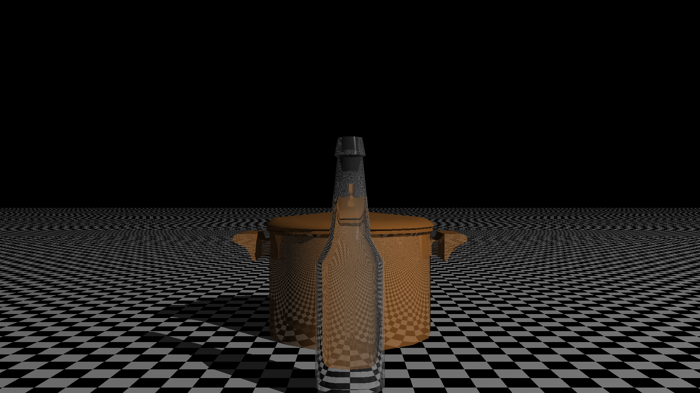

Code for a raytracer following the book "The Ray Tracer Challenge" By Jamis Buck. Additional improvements include a TLAS and BLAS for performance improvements as well as multithreading using OpenMP.  

Build instructions on windows

The only dependency is the Catch2 testing library. CMAKE will download the source and build the library alongside the project. 

mkdir build 
cd build 
cmake..
cmake --build . --config Release

Some cool looking renders!

Inline-style: 

